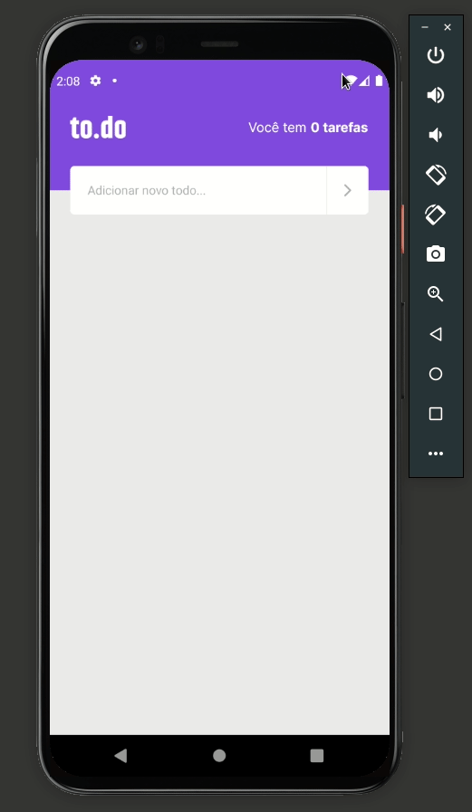

# Todo

#### Aplicação de lembrete de tarefas, as funcionalidades do aplicativo são:

* Contagem de tarefas;
* Adicionar uma nova tarefa;
* Remover uma traefa;
* Marcar e desmarcar uma tarefa como concluída;

## Tecnologias:
 

 
 
 
<h1 align="center">
  
</h1>